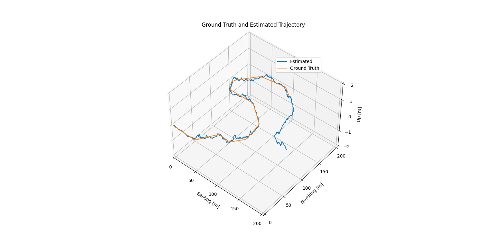

# Trajectory Estimation and Visualization

## Project Overview

This project focuses on estimating and visualizing the trajectory of a moving object using data from multiple sensors. The sensors involved are:

- **IMU** (Inertial Measurement Unit)
- **GNSS** (Global Navigation Satellite System)
- **LIDAR** (Light Detection and Ranging)

The goal is to implement an Error-State Extended Kalman Filter (ES-EKF) to combine the measurements from different sensors and produce an accurate estimate of the object's position and trajectory. The project consists of several steps:

1. **Kalman Filter Implementation:** Complete the prediction and correction steps of the ES-EKF using IMU data to propagate the state and GPS and LIDAR position updates to correct the estimate.

2. **Handling Sensor Calibration Errors:** Examine the impact of sensor miscalibration by adjusting the filter's noise variances to compensate for errors caused by incorrect sensor transformations.

3. **Handling Sensor Dropout:** Explore how the absence of GPS and LIDAR measurements affects position estimation and how uncertainty evolves when external corrections are unavailable.

## Data

The data used in this project is stored in a pickle file named `data/pt1_data.pkl`. The dataset contains:
- `gt`: Ground truth trajectory data.
- `imu_f`: IMU accelerometer data.
- `imu_w`: IMU gyroscope data.
- `gnss`: GNSS position data.
- `lidar`: LIDAR point cloud data.

## Dependencies

This project requires the following Python packages:

- `numpy`
- `matplotlib`
- `pickle` (part of the Python standard library)
- `mpl_toolkits` (part of `matplotlib`)
- `rotations` (a custom module for quaternion and rotation operations)

## Program Results 

The results are visualized in a 3D plot showing the estimated trajectory and the ground truth trajectory. The plot uses Matplotlib's 3D plotting capabilities.

## Contributing

Feel free to fork this project, submit issues and pull requests. Contributions are welcome!
